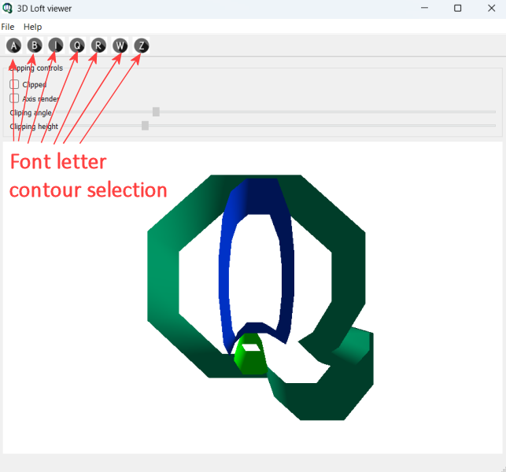
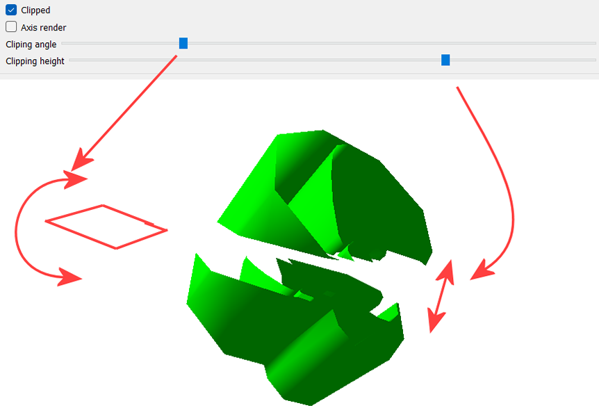

# Font characters 3D visualizer and 3D mesh clip demonstration

## Contents

*    [Introduction](#introduction)
*    [Prerequisites](#prerequisites)
*    [How to build and run main application under Windows 11](#how-to-build-and-run-main-application-under-windows-11)
*    [How to build application under Ubuntu 22.04](#how-to-build-application-under-ubuntu-2204)
*    [User interface](#user-interface)
*    [Project structure](#project-structure)
*    [Things for improvement](#things-for-improvement)


## Introduction
This is a simple, demonstration project (not part of any commercial software)
can load some english letters (from 2D contours vector description), creating a 3D loft
from 2D contour and apply a clipping plane (can be controlled in the application
user interface).

## Prerequisites

Application was developed and tested under:
1) Windows 11, with QT 5.12.2 and compiled using MSVC Community 2022. You need also cmake (at least 3.19).
2) Ubuntu 22.04, with QT 5.13.0 and compiled with GCC.

## How to build and run main application under Windows 11

To build application, please run `build_cmake.cmd` in Windows 11

To run application, just run:
```
cd build
cd Debug
loftviewer.exe
```

To run tests, just:
```
cd build
cd Debug
tests_loftviewer.exe
```

For additional sources syntax check, please run `clang-tidy.cmd`. 
You need to have clang compiler and tools for this step.

For auto documentation, please run `doxygen doxygen.conf`.
You need to have doxygen tool installed on computer.

## How to build application under Ubuntu 22.04

Use script `build_cmake.sh` to build application
                                                        
## User interface

Application provides 7 english alphabet letters 2d contours:
A, B, i, Q, R, W, Z

Selection of these letters is connected to their non-convex contours.

Main application windows looks like:


Clipping interactivity provides following functionality:
1) User can changle clippping plane angle
2) User can change distance between clipped mesh
This functionality is illustrated below:


## Project structure

```
src
   |-- data            Json files with letters 2D contours.
   |-- doc             Images for this documentation
   |-- res             Icon application resources
   |-- src             C++ source code
```

## Things for improvement
- Add ref to OBJ viewer

  OBJ viewer:
  https://www.meshy.ai/3d-tools/online-viewer/obj
- In future maybe add "open arbitrary OBJ file" function in menu.

